<!-- Portrait: skipped for now. To add one later:
     python3 scripts/make_portrait.py photo.png --crop L,T,R,B
     python3 scripts/embed_portrait_font.py
     then:  -->

# YOUR NAME

<!-- populates on the first run of the stats workflow -->

[your-site.com](https://YOUR_SITE) &nbsp;·&nbsp;
[instagram](https://instagram.com/YOUR_HANDLE) &nbsp;·&nbsp;
[linkedin](https://www.linkedin.com/in/YOUR_HANDLE/) &nbsp;·&nbsp;
[email](mailto:YOUR_EMAIL)

> ONE-LINE WHO/WHERE YOU ARE. 
> A SHORT PRINCIPLE YOU WORK BY.

TWO OR THREE SENTENCES ON WHAT YOU'RE BUILDING RIGHT NOW AND WHAT YOU CARE 
ABOUT. Link the current main project like [projectname](https://github.com/ypx-ux/projectname).

<samp>LANG &nbsp; LANG &nbsp; FRAMEWORK &nbsp; TOOL &nbsp; TOOL &nbsp; TOOL</samp>

**[project-one](https://github.com/ypx-ux/project-one)** &nbsp;·&nbsp; <samp>lang, lib</samp> 
ONE OR TWO LINES ON WHAT IT DOES AND WHY IT'S INTERESTING.

**[project-two](https://github.com/ypx-ux/project-two)** &nbsp;·&nbsp; <samp>lang</samp> 
ONE OR TWO LINES.

**[project-three](https://github.com/ypx-ux/project-three)** &nbsp;·&nbsp; <samp>lang</samp> 
ONE OR TWO LINES.

Every graphic here is generated, not embedded from anyone else's server. 
The stat graphics and these section headings are drawn by 
[a scheduled action](.github/workflows/stats.yml) straight from the GitHub GraphQL 
API, once a day, committing only what changed.

They animate with SMIL inside the SVG, because GitHub strips scripts from 
READMEs — and since nothing loads from a third party, nothing here can 
rate-limit or go dark. The headings are SVGs for the same reason: GitHub also 
strips CSS, so an image is the only way to put this page's own typeface on them.

The typeface is [JetBrains Mono](scripts/fonts), subset to just the characters 
each graphic draws and inlined as base64.

Language totals cover public repositories only. `year.svg` uses a 
character ramp: `:` `+` `#` `@`, quiet to loud.
